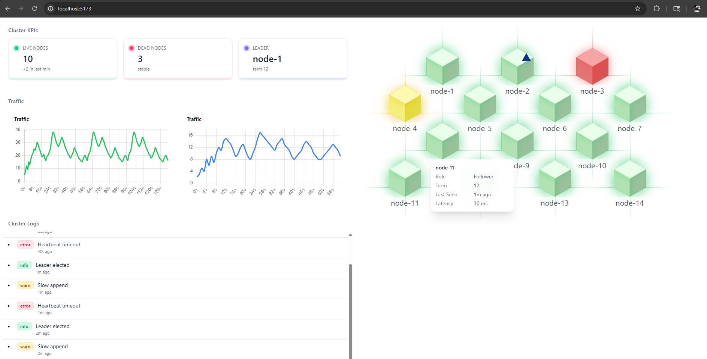
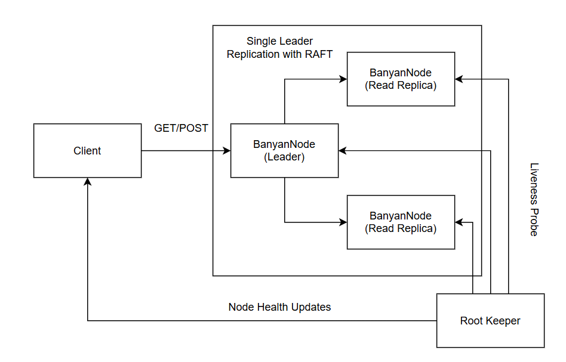

# Banyan Tree

**Banyan Tree** is a work-in-progress RAFT implementation.

---

## Overview

Banyan Tree is made up of three core components:

* **BanyanNode** – A FastAPI-based Raft node. Each node participates in leader elections, sends/receives heartbeats, and can append log entries.
* **NodeMonitor** – Tracks node health in real time, including last seen time and latency. Acts as the data source for the UI’s traffic and status indicators.
* **RootKeeper** – A lightweight control plane that maintains cluster membership, coordinates leader elections, and stores the authoritative cluster state.

The **React-based dashboard** displays:

* Live KPIs: active nodes, dead nodes, current leader and term
* Traffic metrics (reads and writes over time)
* A cluster map with node roles, term numbers, latency, and last seen timestamps
* Real-time log feed with collapsible JSON details

---

## Current Features

* **Leader election** via RootKeeper
* **Heartbeat monitoring** and status tracking
* **Cluster visualization** with role-based coloring
* **Traffic charts** for read/write throughput
* **Collapsible logs** with severity tags (info/warn/error)

---

## Architecture

---

## Status

This is an **active WIP**.
Core leader election and monitoring are functional, but APIs, metrics, and visualization are evolving quickly.

---

Do you want me to also make a **shorter “project badge” style header** for the README so it feels like an open-source repo at a glance? That would make it instantly recognizable as a WIP project.
